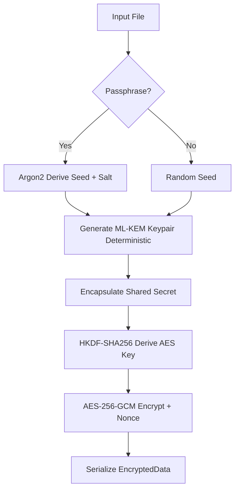

# User Guide
This guide provides a comprehensive overview of the `post-quantum-encryption` tool, from basic usage to advanced features. It is designed to help you quickly get started and master all of the tool's capabilities.
## 1. Getting Started
### Prerequisites
* **Rust programming language and Cargo build tool.**
* If you don't have Rust installed, you can get it from [rustup.rs](https://rustup.rs/).
### Installation
Install the tool directly using Cargo. This is the simplest way to get the latest stable version.
```bash
cargo install post-quantum-encryption
```
## 2. Interactive Usage
Run the command to begin the interactive experience:
```bash
post-quantum-encryption
```
### 2.1 Encrypting a File
Choose option 1, enter the file path, and select replace or copy mode.
```bash
post-quantum-encryption
# Follow prompts: Select 1, enter path, choose mode
```
### 2.2 Decrypting a File
Choose option 2, provide the `.mlkem` file path, and specify an extension for copy mode.
```bash
post-quantum-encryption
# Select 2, enter path, provide extension (e.g., txt)
```
### 2.3 Encrypting a Folder
Choose option 3, enter folder path, and select mode. Files are processed in parallel with progress bars.
```bash
post-quantum-encryption
# Select 3, enter folder path, choose mode
```
### 2.4 Decrypting a Folder
Choose option 4, provide folder path and extension for decrypted files.
```bash
post-quantum-encryption
# Select 4, enter folder path, provide extension
```
## 3. Command-Line Arguments
For automation or advanced use, bypass the interactive menu with subcommands.
### Help Menu
```bash
post-quantum-encryption --help
```
### Encrypt a File
```bash
post-quantum-encryption encrypt --file secret.txt --mode copy --passphrase
```
### Decrypt a File
```bash
post-quantum-encryption decrypt --file secret.txt.mlkem --mode copy --extension txt
```
### Encrypt a Folder
```bash
post-quantum-encryption encrypt --folder my_folder --mode copy
```
### Decrypt a Folder
```bash
post-quantum-encryption decrypt --folder enc_folder --mode copy --extension txt
```
### Generate Keypair
```bash
post-quantum-encryption keygen --output my_keys
```
## 4. Configuration
Edit `~/.post-quantum-encryption/config.toml` for defaults:
```toml
default_mode = "copy"
default_extension = ".mlkem"
verbosity = true
```
## 5. CLI Examples
```bash
post-quantum-encryption encrypt --file secret.txt --mode copy --passphrase
post-quantum-encryption decrypt --folder enc_dir --extension txt
```
## 6. Encryption Flow

## 7. Troubleshooting
- **File Not Found**: Verify path and permissions.
- **Cryptographic Error**: Ensure `.mlkem` file was encrypted with this tool.
- **Passphrase Error**: Verify passphrase matches encryption.
